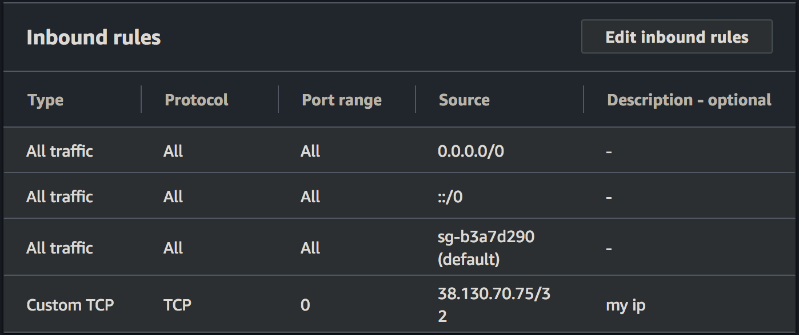

<h3 align="right">Final Project</h3>
<h6 align="right">MACS 30123: Large-Scale Computing for the Social Sciences | Spring 2020</h6>

<h2 align="center">Per-Block Building Capacity</h2>
<h4 align="center"><i>Heuristics for Targeted Urban Infrastructure Investment</i></h4>

### Background 

### Architecture

#### Overview
The centerpiece of the architecture is a managed PostgreSQL database (on Amazon RDS). The reason for this is that.

#### Upload Stage
The current data, as a result of the Million Neighborhoods Project, is stored on the `/project2` netowr

#### Hydration Stage
First, the PostGIS extensions, in-band permissions, and associated tables must be created (`src/hydrate/setup.sql`). Since PostGIS is installed but not activated, the extension must be installed and proper permissions need to be granted to the RDS superuser for management and configuration purposes. We must also set up our tables and schema as needed so that our code to transfer data from S3 has a proper destination.

There are 2 relevant tables: `buildings` and `blocks`, with the following schemas. These tables do not need to be created explicitly in our setup script because our hydration EMR job can handle creating them and the R-tree indices automatically if they do not exist.

Next, the out-of-band permissions need to be configured by setting the RDS VPC's in-bound connection rules to accept traffic from the local machine (for debugging purposes; spinning up an EMR cluster in the same VPC as the database instance will automatically be able to make in-bound connections to the database.)

Finally, an EMR job is spun up to hydrate each table. For each country in our dataset, we get a list of S3 filepaths and create a GeoPandas dataframe from each filepath. 

#### Querying Stage

Granted, multiple packages exist to make the entire Lambda process much more streamlined. However, a major limitation of packages like `pywren` at time of writing is the inflexibility 

### Resources
- https://stackoverflow.com/questions/34758338/how-to-populate-a-postgresql-database-with-mrjob-and-hadoop
- https://www.youtube.com/watch?v=BzjeZFej_0k
- https://gis.stackexchange.com/questions/239198/adding-geopandas-dataframe-to-postgis-table
- https://www.classes.cs.uchicago.edu/archive/2013/spring/12300-1/labs/lab5/
- https://serverfault.com/questions/656079/unable-to-connect-to-public-postgresql-rds-instance
