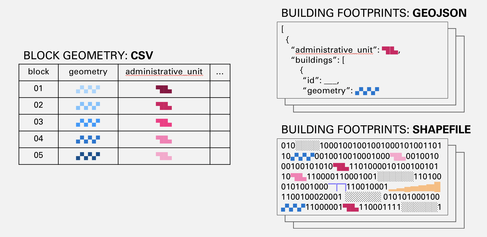
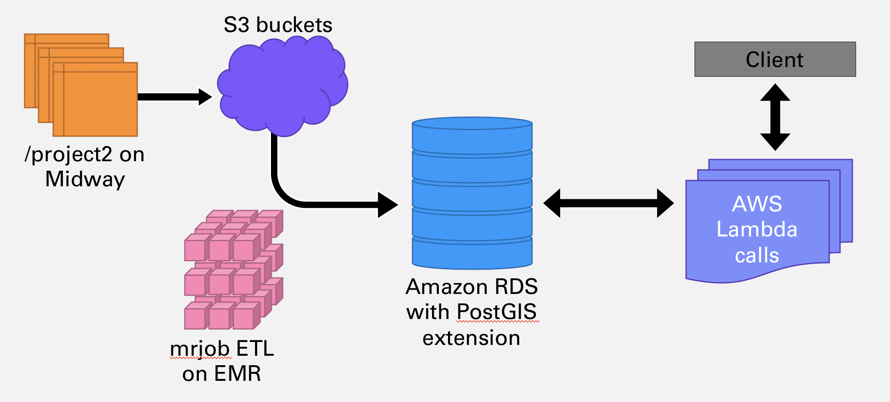
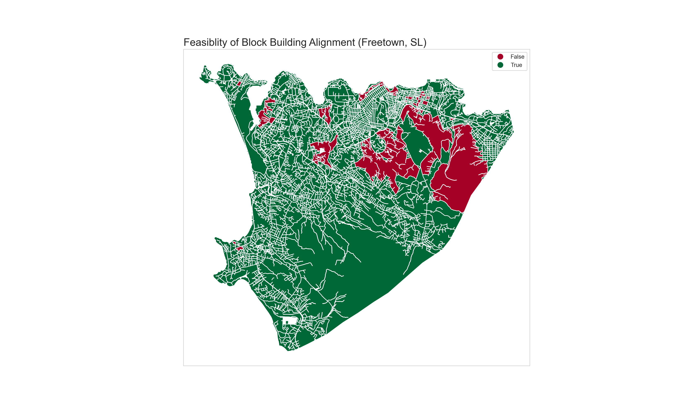

<h3 align="right">Final Project</h3>
<h6 align="right">MACS 30123: Large-Scale Computing for the Social Sciences | Spring 2020</h6>

<h2 align="center">Per-Block Building Capacity</h2>
<h4 align="center"><i>Heuristics for Targeted Urban Infrastructure Investment</i></h4>

### Background 
Community-driven infrastructure investment in the developing world has focused on reacting to deficits in the formal physical infrastructure by implementing in-situ upgrades (e.g. moving buildings within existing street blocks, or creating informal paths to increase the access of inhabitants to formal infrastructure. However, this approach has limits in cases where the formal infrastructure (roads, power, sewage, sanitation, etc.) is insufficiently developed to provide for an adequate quality of life. In these cases, it is useful to have a heuristic to distinguish between blocks in which in-situ approaches are appropriate and those in which further formal investment is needed.

One potential heuristic is per-block building capacity. In short, if all the buildings in a block can be aligned to the edges of a street block, there is enough physical space in the block to provide formal infrastructure needs for the inhabitants of the enclosed buildings. To calculate this, we sum the maximum linear dimension of each building footprint and consider a block a candidate for infrastructure investment if this sum exceeds the perimeter of the enclosing street block.

This calculation, while straightforward in theory, is difficult to implement in practice due to data fragmentation. Building footprints, depending on the source, are available in a number of different geospatial file formats. For example, OpenStreetMap provides downloadable Protocol Buffer files for its geospatial vector layers, while private providers often provide data in the form of an ESRI Shapefile. The block geometry data are in CSV formats with geometry described using the Well-Known Text (WKT) protocol. 



These data formats are incompatible with each other and need to be converted to a common format in order to run the comparison calculations described above.

However, in-memory or on-disk file flattening approaches do not lend themselves to analysis because queries on subsets of the data are expensive.

The ideal solution is to use a geospatial database for several reasons.

1. Geospatial databases offer a common data storage format for data in heterogenous and incompatible formats.

2. A database solution offers a better persistence story for data fragmented into different sets of files.

3. A geospatial database offers R-tree indices to speed up the necessary geometric intersection calculations, and regular B-tree indices to allow for subsetting the data in an efficient way.

### Architecture


#### Overview
The centerpiece of the architecture is a managed PostgreSQL database (on Amazon RDS). This managed database solution offers a PostGIS extension that implements the geospatial primitives necessary for this analysis. The raw data is uploaded to S3 using the AWS command-line tools, and then seeded into the database via Elastic MapReduce. The data is then queried by a series of AWS Lambda invocations, as described in the following sections.

#### Upload Stage
The current data, as a result of the Million Neighborhoods Project, is stored on the `/project2` networked filesystem. I used the `awscli` command line tool to recursively upload data for each country in Africa to S3. I chose the command-line approach rather than using the `boto` library in a Python script because the `awscli` utility offers two key features that optimized both time and resource utilization:

1. A recursive file traversal option in the `s3 cp` subcommand, which removed the need for me to manually traverse the filesystem to find all files to upload. 

2. A connection/pooling reuse system, which optimized bandwidth usage so I did not have to spin up a new connection for each of the thousands of files in my dataset.

#### Hydration Stage
First, the PostGIS extensions, in-band permissions, and associated tables must be created (`src/hydrate/setup.sql`). Since PostGIS is installed but not activated, the extension must be installed and proper permissions need to be granted to the RDS superuser for management and configuration purposes. We must also set up our tables and schema as needed so that our code to transfer data from S3 has a proper destination.

There are 2 relevant tables: `buildings` and `blocks`, containing the geometry for each object type. These tables do not need to be created explicitly in our setup script because our hydration EMR job can handle creating them and the R-tree indices automatically if they do not exist.

Next, the out-of-band permissions need to be configured by setting the RDS VPC's in-bound connection rules to accept traffic from the local machine (for debugging purposes; spinning up an EMR cluster in the same VPC as the database instance will automatically be able to make in-bound connections to the database.)


Finally, an EMR job is spun up to hydrate each table. For each country in our dataset, we get a list of S3 filepaths and create a GeoPandas dataframe from each filepath. 

#### Querying Stage

The implementation of the feasibility metric is below. This calculation could be done server-side, but the implementation is cleaner and easier to express in client-side high-level code rather than with SQL clauses. 

```Python
def is_feasible(block: shapely.geometry.Polygon, buildings: Sequence[shapely.geometry.Polygon]) -> bool:
    min_area_rects = (list(p.minimum_rotated_rectangle.exterior.coords) for p in buildings)
    return block.length > sum(min(shapely.geometry.LineString(rectangle[i:i+2]).length for i in range(len(rectangle)-1)) for rectangle in min_area_rects)
```

The implementation has almost no per-block state; all one requires is an identifier for each block in order to query the blocks table to get the geometry and then intersect that geometry against the geometries in the buildings table. This minimal state indicates a serverless approach to distributing this query is a workable solution. AWS Lambda has a number of client-side management frameworks, such as `pywren`, but I chose to use the lower-level `boto` API to manually distribute and schedule invocations due to two constraints:

1. *VPC firewalls.* Despite setting out-of-band permissions on the database by adding firewall setting entries, I was unable to make database connections from `pywren` calls to my RDS instance. With a manually-specified Lambda, VPC configurations and IAM roles can be configured with greater flexibility, as was needed in this project. Specifically, I had to add the `AWSLambdaVPCAccessExecutionRole` to my Lambda to get RDS calls to work.

2. *C-runtime dependencies not included in the basic AWS Python SDK.* Both the database driver code and the client-side geospatial analysis code depend on C/C++ libraries (`SQLAlchemy` and `GDAL`, respectively.) The default environment hard-coded into `pywren` limits users to a runtime that does not support these C/C++ dependencies. By uploading a dependencies zip through the AWS management console, we can manually bundle in the dependencies needed to run our Lambda code.

### Results
The below is an analysis of every street block in Freetown, Sierra Leone. The red blocks indicate areas where further infrastructure investment is necessary, as there is insufficient street length to provide direct access to every enclosed building.



I hope to apply this analysis to countries with different land-use density profiles, such as Lesotho and Nairobi, in the future.


### Resources
- https://stackoverflow.com/questions/34758338/how-to-populate-a-postgresql-database-with-mrjob-and-hadoop
- https://www.youtube.com/watch?v=BzjeZFej_0k
- https://gis.stackexchange.com/questions/239198/adding-geopandas-dataframe-to-postgis-table
- https://www.classes.cs.uchicago.edu/archive/2013/spring/12300-1/labs/lab5/
- https://serverfault.com/questions/656079/unable-to-connect-to-public-postgresql-rds-instance
